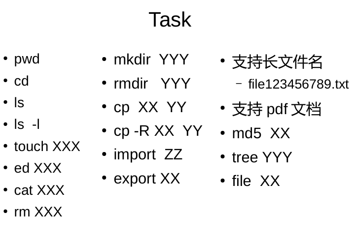

<div align="center">

# 实验报告（十四）：FAT32文件系统的架构分析和接口实现

2314342 耿展

</div>

## 一、实验目的

1. 针对本案例的fat32文件系统磁盘映像，编写程序实现常用的文件系统访问函数；


   
2. 给出fat32文件系统布局、文件及目录的实现方法、文件及目录的操作方法。

## 二、实验过程

### 1、访问文件系统镜像的基本思路

FAT文件系统结构相对简单，可大致分为三个区域：储存系统元信息的DBR，储存文件簇元信息的FAT表，以及储存目录和文件的数据分区，其中每个文件的元信息则存放在目录项中。显然，获取元信息对访问文件系统至关重要。因此，我们设计了一系列结构体来读取这些信息。分述如下：

1. **FSInfo** 用于存放文件系统元信息
```C
typedef struct {
    uint16_t bytes_per_sector;
    uint8_t  sectors_per_cluster;
    uint16_t reserved_sector_count;
    uint8_t  num_FATs;
    uint32_t FATSz32;     //FAT表项总数
    uint32_t root_cluster;      //根目录簇号
    uint32_t tot_sec;
    uint32_t total_clusters;
    uint32_t first_FAT_sector; 
    uint32_t first_data_sector;     //根目录起始扇区
    uint64_t image_size_bytes;
    uint32_t cwd_cluster;           //当前簇
    char image_name[256];

    FILE *fp;
} FSInfo;
```

2. **FAT32BootSector** 用于存放DBR扇区数据
   
```C
#pragma pack(push,1)
typedef struct {
    uint8_t  BS_jmpBoot[3];
    uint8_t  BS_OEMName[8];
    uint16_t BPB_BytsPerSec;
    uint8_t  BPB_SecPerClus;
    uint16_t BPB_RsvdSecCnt;
    uint8_t  BPB_NumFATs;
    uint16_t BPB_RootEntCnt;
    uint16_t BPB_TotSec16;
    uint8_t  BPB_Media;
    uint16_t BPB_FATSz16;
    uint16_t BPB_SecPerTrk;
    uint16_t BPB_NumHeads;
    uint32_t BPB_HiddSec;
    uint32_t BPB_TotSec32;
    uint32_t BPB_FATSz32;
    uint16_t BPB_ExtFlags;
    uint16_t BPB_FSVer;
    uint32_t BPB_RootClus;
    uint16_t BPB_FSInfo;
    uint16_t BPB_BkBootSec;
    uint8_t  BPB_Reserved[12];
    uint8_t  BS_DrvNum;
    uint8_t  BS_Reserved1;
    uint8_t  BS_BootSig;
    uint32_t BS_VolID;
    uint8_t  BS_VolLab[11];
    uint8_t  BS_FilSysType[8];
} FAT32BootSector;
#pragma pack(pop)
```
3. **DirEntry**用于存放目录项
   
```C
#pragma pack(push,1)
typedef struct {
    uint8_t DIR_Name[11];
    uint8_t DIR_Attr;
    uint8_t DIR_NTRes;
    uint8_t DIR_CrtTimeTenth;
    uint16_t DIR_CrtTime;
    uint16_t DIR_CrtDate;
    uint16_t DIR_LstAccDate;
    uint16_t DIR_FstClusHI;
    uint16_t DIR_WrtTime;
    uint16_t DIR_WrtDate;
    uint16_t DIR_FstClusLO;
    uint32_t DIR_FileSize;
} DirEntry;
#pragma pack(pop)
```
需要注意的是，DirEntry和FAT32BootSector是通过fread逐字节读取文件得到的，因此需要取消结构体对齐，保证结构体的成员紧密排布。

另外，DirEntry中的DIR_Attr记录了文件属性，表示如下：
```C
#define ATTR_READ_ONLY   0x01
#define ATTR_HIDDEN      0x02
#define ATTR_SYSTEM      0x04
#define ATTR_VOLUME_ID   0x08
#define ATTR_DIRECTORY   0x10
#define ATTR_ARCHIVE     0x20
#define ATTR_LONG_NAME (ATTR_READ_ONLY|ATTR_HIDDEN|ATTR_SYSTEM|ATTR_VOLUME_ID)
```
仅仅有了元信息还远远不够。我们知道，扇区（sector）是磁盘读写的基本单位，而文件簇（cluster）是文件系统操作的基本单位，两者的大小关系不确定，因此，必须实现对扇区的读写，以及从文件簇到扇区的转换。在FAT表中，顺序存储着所有文件簇的使用情况，同一个文件/目录占用的所有文件簇以链表的形式依次记录它的后继。为了实现对簇链的遍历，必须实现访问FAT表的相关函数。以下就对这些内部函数加以介绍。

1. 扇区读写
```C
int read_sector(uint32_t sector, uint8_t *buffer) {
    if (!fsinfo.fp) return -1;
    if (fseek(fsinfo.fp, sector * fsinfo.bytes_per_sector, SEEK_SET)!=0) return -1;
    if (fread(buffer, 1, fsinfo.bytes_per_sector, fsinfo.fp)!=fsinfo.bytes_per_sector) return -1;
    return 0;
}

int write_sector(uint32_t sector, const uint8_t *buffer) {
    if (!fsinfo.fp) return -1;
    if (fseek(fsinfo.fp, sector * fsinfo.bytes_per_sector, SEEK_SET)!=0) return -1;
    if (fwrite(buffer, 1, fsinfo.bytes_per_sector, fsinfo.fp)!=fsinfo.bytes_per_sector) return -1;

    return 0;
}
```

2. 簇-扇区转换
```C
uint32_t cluster_to_sector(uint32_t cluster) {
    return (cluster - 2)*fsinfo.sectors_per_cluster + fsinfo.first_data_sector;
}
```

3. 获取FAT表项
```C
uint32_t get_fat_entry(uint32_t cluster) {
    uint32_t fat_offset = cluster *4;
    uint32_t sector_num = fsinfo.first_FAT_sector + (fat_offset / fsinfo.bytes_per_sector);
    uint32_t offset_in_sector = fat_offset % fsinfo.bytes_per_sector;

    uint8_t sector[512];
    if (read_sector(sector_num, sector)!=0) return EOC;
    uint32_t val = *((uint32_t*)&sector[offset_in_sector]) & 0x0FFFFFFF;
    return val;
}
```
通过该函数，可以根据簇号获得其在FAT表中的信息：是否为空/坏簇/终结簇？

4. 设置FAT表项
```C
int set_fat_entry(uint32_t cluster, uint32_t value) {
    uint32_t fat_offset = cluster *4;
    uint32_t sector_num = fsinfo.first_FAT_sector + (fat_offset / fsinfo.bytes_per_sector);
    uint32_t offset_in_sector = fat_offset % fsinfo.bytes_per_sector;

    uint8_t sector[512];
    if (read_sector(sector_num, sector)!=0) return -1;
    *((uint32_t*)&sector[offset_in_sector]) = value;
    if (write_sector(sector_num, sector)!=0) return -1;

    for (int i=1; i<fsinfo.num_FATs; i++) {
        uint32_t backup_sec = fsinfo.first_FAT_sector + i*fsinfo.FATSz32 + (fat_offset / fsinfo.bytes_per_sector);
        if (fseek(fsinfo.fp, backup_sec*fsinfo.bytes_per_sector, SEEK_SET)!=0) return -1;
        if (fwrite(sector, 1, fsinfo.bytes_per_sector, fsinfo.fp)!=fsinfo.bytes_per_sector) return -1;
    }

    return 0;
}
```

### 2、文件系统Shell的设计与实现

针对实验目的1，设计了一个可以访问FAT32镜像文件的shell，并在其中内置了一系列命令。以下就围绕Shell的设计思路进行讲解。

首先，该shell无需借助linux内核，能够直接访问镜像文件。为此，设计了fs_mount和fs_unmount函数，用于载入文件系统镜像的各种信息：

```C
int fs_mount(const char *image_path) {
    memset(&fsinfo,0,sizeof(fsinfo));
    memset(open_files,0,sizeof(open_files));

    fsinfo.fp = fopen(image_path, "r+b");
    if (!fsinfo.fp) {
        perror("fopen");
        return -1;
    }
    strncpy(fsinfo.image_name, image_path, sizeof(fsinfo.image_name)-1);

    uint8_t sector[512];
    if (fread(sector,1,512,fsinfo.fp)!=512) {
        fclose(fsinfo.fp);
        return -1;
    }
    memcpy(&bs, sector, sizeof(FAT32BootSector));

    fsinfo.bytes_per_sector = bs.BPB_BytsPerSec;
    fsinfo.sectors_per_cluster = bs.BPB_SecPerClus;
    fsinfo.reserved_sector_count = bs.BPB_RsvdSecCnt;
    fsinfo.num_FATs = bs.BPB_NumFATs;
    fsinfo.FATSz32 = bs.BPB_FATSz32;
    fsinfo.root_cluster = bs.BPB_RootClus;

    if (bs.BPB_TotSec32!=0) fsinfo.tot_sec = bs.BPB_TotSec32;
    else fsinfo.tot_sec = bs.BPB_TotSec16;

    fseek(fsinfo.fp,0,SEEK_END);
    fsinfo.image_size_bytes = ftell(fsinfo.fp);
    fseek(fsinfo.fp,0,SEEK_SET);

    fsinfo.first_FAT_sector = fsinfo.reserved_sector_count;
    fsinfo.first_data_sector = fsinfo.reserved_sector_count + fsinfo.num_FATs * fsinfo.FATSz32;
    fsinfo.total_clusters = (fsinfo.tot_sec - fsinfo.first_data_sector)/fsinfo.sectors_per_cluster;
    fsinfo.cwd_cluster = fsinfo.root_cluster;

    return 0;
}

void fs_unmount() {
    if (fsinfo.fp) {
        fclose(fsinfo.fp);
        fsinfo.fp=NULL;
    }
}
```

由于个人能力和时间有限，未能实现全部命令。将已经实现的命令展示如下：

1. pwd
```C
if(strcmp(args[0], "pwd") == 0) {
    printf("%s\n", current_path);
}
```

2. sysinfo
```C
int fs_info() {
    printf("position of root cluster: %u\n", fsinfo.root_cluster);
    printf("bytes per sector: %u\n", fsinfo.bytes_per_sector);
    printf("sectors per cluster: %u\n", fsinfo.sectors_per_cluster);
    printf("total # of clusters in data region: %u\n", fsinfo.total_clusters);
    printf("# of entries in one FAT: %u\n", (fsinfo.FATSz32 * (fsinfo.bytes_per_sector/4)));
    printf("size of image (in bytes): %llu\n",(unsigned long long)fsinfo.image_size_bytes);
    return 0;
}
```

3. cd
```C
int fs_cd(const char *dirname) {
    if (strcmp(dirname,".")==0) return 0;
    if (strcmp(dirname,"..")==0) {
        if (fsinfo.cwd_cluster == fsinfo.root_cluster) return 0;
        DirEntry entry; uint32_t sec, off;
        if (fs_find_entry_in_dir(fsinfo.cwd_cluster,"..",&entry,&sec,&off)==0) {
            uint32_t parent = ((uint32_t)entry.DIR_FstClusHI<<16)|entry.DIR_FstClusLO;
            if (parent==0) parent=fsinfo.root_cluster;
            fsinfo.cwd_cluster=parent;
        }
        return 0;
    } else {
        DirEntry entry; uint32_t sec, off;
        if (fs_find_entry_in_dir(fsinfo.cwd_cluster, dirname,&entry,&sec,&off)==0) {
            if (entry.DIR_Attr & ATTR_DIRECTORY) {
                uint32_t c = ((uint32_t)entry.DIR_FstClusHI<<16)|entry.DIR_FstClusLO;
                if (c==0) c=fsinfo.root_cluster;
                fsinfo.cwd_cluster=c;
                return 0;
            } else {
                print_error("Not a directory.");
                return -1;
            }
        } else {
            print_error("Directory does not exist.");
            return -1;
        }
    }
}

```   
4. ls
```C
int fs_ls() {
    uint32_t cluster = fsinfo.cwd_cluster;
    uint8_t buf[512];
    while (cluster<0x0FFFFFF8) {
        for (int s=0; s<fsinfo.sectors_per_cluster; s++) {
            uint32_t sec = cluster_to_sector(cluster)+s;
            if (read_sector(sec, buf)!=0) return -1;
            for (int i=0; i<fsinfo.bytes_per_sector;i+=32) {
                DirEntry *e=(DirEntry*)&buf[i];
                if (e->DIR_Name[0]==0x00) return 0;
                if ((e->DIR_Attr & ATTR_LONG_NAME)==ATTR_LONG_NAME || e->DIR_Name[0]==0xE5) continue;
                char fname[12];
                memcpy(fname,e->DIR_Name,11);
                fname[11]='\0';
                for (int k=10;k>=0;k--) {
                    if (fname[k]==' '||fname[k]==0x20) fname[k]='\0';
                    else break;
                }
                
                if(e->DIR_Attr & ATTR_DIRECTORY) printf("\033[34m%s\033[0m    ",fname);
                else printf("%s    ",fname);
            }
        }
        cluster=get_fat_entry(cluster);
    }
    return 0;
}
```
6. touch
```C
int fs_creat(const char *filename) {
    if (fs_name_exists_in_dir(fsinfo.cwd_cluster, filename)) {
        print_error("Name already exists.");
        return -1;
    }
    if (create_dir_entry(fsinfo.cwd_cluster, filename, 0, 0, 0)!=0) {
        print_error("Failed to create file entry.");
        return -1;
    }
    return 0;
}
```
7. rm
```C
int fs_rm(const char *filename) {
    for (int i=0;i<MAX_OPEN_FILES;i++){
        if (open_files[i].in_use && strcmp(open_files[i].name,filename)==0){
            print_error("File is opened.");
            return -1;
        }
    }
    DirEntry e;uint32_t s,o;
    if (fs_find_entry_in_dir(fsinfo.cwd_cluster,filename,&e,&s,&o)!=0) {
        print_error("File does not exist.");
        return -1;
    }
    if (e.DIR_Attr & ATTR_DIRECTORY) {
        print_error("Is a directory.");
        return -1;
    }
    uint32_t c=((uint32_t)e.DIR_FstClusHI<<16)|e.DIR_FstClusLO;
    if (c!=0) fs_free_cluster_chain(c);

    uint8_t sec_buf[512];
    if (read_sector(s,sec_buf)!=0)return -1;
    sec_buf[o]=0xE5;
    if (write_sector(s,sec_buf)!=0)return -1;
    return 0;
}
```
8. rename
```C
int fs_rename(const char *oldname, const char *newname) {
    for (int i=0;i<MAX_OPEN_FILES;i++){
        if (open_files[i].in_use && strcmp(open_files[i].name,oldname)==0){
            print_error("File must be closed first.");
            return -1;
        }
    }

    DirEntry olde;uint32_t s,o;
    if (fs_find_entry_in_dir(fsinfo.cwd_cluster,oldname,&olde,&s,&o)!=0) {
        print_error("Old name does not exist.");
        return -1;
    }
    if (strcmp(oldname,".")==0||strcmp(oldname,"..")==0) {
        print_error("Cannot rename special directories.");
        return -1;
    }
    if (fs_name_exists_in_dir(fsinfo.cwd_cluster,newname)) {
        print_error("New name already exists.");
        return -1;
    }

    uint8_t sec_buf[512];
    if (read_sector(s,sec_buf)!=0) return -1;
    DirEntry *ent=(DirEntry*)&sec_buf[o];
    char formatted[11]; format_name_11(newname,formatted);
    memcpy(ent->DIR_Name,formatted,11);
    if (write_sector(s,sec_buf)!=0) return -1;

    return 0;
}
```
9.  mkdir
```C
int fs_mkdir(const char *dirname) {
    if (fs_name_exists_in_dir(fsinfo.cwd_cluster, dirname)) {
        print_error("Name already exists.");
        return -1;
    }
    uint32_t new_cluster;
    
    if (fs_allocate_cluster_chain(1,&new_cluster)!=0) {
        print_error("No space.");
        return -1;
    }

    uint8_t buf[512];
    memset(buf,0,512);
    for (int i=0;i<fsinfo.sectors_per_cluster;i++) {
        if (write_sector(cluster_to_sector(new_cluster)+i,buf)!=0) {
            print_error("Failed init dir cluster.");
            return -1;
        }
    }

    
    if (create_dir_entry(new_cluster,".",ATTR_DIRECTORY,new_cluster,0)!=0) {
        print_error("Failed to create '.'");
        return -1;
    }
    uint32_t parent = fsinfo.cwd_cluster;
    if (create_dir_entry(new_cluster,"..",ATTR_DIRECTORY,(parent==0?fsinfo.root_cluster:parent),0)!=0) {
        print_error("Failed to create '..'");
        return -1;
    }

    if (create_dir_entry(fsinfo.cwd_cluster, dirname, ATTR_DIRECTORY,new_cluster,0)!=0) {
        print_error("Failed to create directory entry in cwd.");
        return -1;
    }
    return 0;
}
```
10.  rmdir
```C
int fs_rmdir(const char *dirname) {
    DirEntry e;uint32_t s,o;
    if (fs_find_entry_in_dir(fsinfo.cwd_cluster,dirname,&e,&s,&o)!=0) {
        print_error("Dir does not exist.");
        return -1;
    }
    if (!(e.DIR_Attr & ATTR_DIRECTORY)) {
        print_error("Not a directory.");
        return -1;
    }

    uint32_t c=((uint32_t)e.DIR_FstClusHI<<16)|e.DIR_FstClusLO;
    if (!fs_is_dir_empty(c)){
        print_error("Directory not empty.");
        return -1;
    }

    if (c!=fsinfo.root_cluster && c!=0) fs_free_cluster_chain(c);

    uint8_t sec_buf[512];
    if (read_sector(s,sec_buf)!=0)return -1;
    sec_buf[o]=0xE5;
    if (write_sector(s,sec_buf)!=0)return -1;

    return 0;
}

```

**附记**：编写程序的过程中，深入学习了[**StellarLaw的github仓库**](https://github.com/StellarLaw/FAT32-Filesystem-Shell-Utility/tree/main)，在此表示诚挚的感谢。